

# Pryisce Engine

### Measure. Diagnose. Optimize. Verify.

A Windows companion for PC games. It shows what is really happening while you play,
finds what is wrong, changes only what has a reason, and proves the difference.

**[Download](https://github.com/pryisce/pryisce-engine/releases/latest)** &nbsp;·&nbsp; **[Patch notes](https://github.com/pryisce/pryisce-engine/releases)** &nbsp;·&nbsp; **[Is it safe?](#is-it-safe)**

## Measure

See what the game is really doing, live.

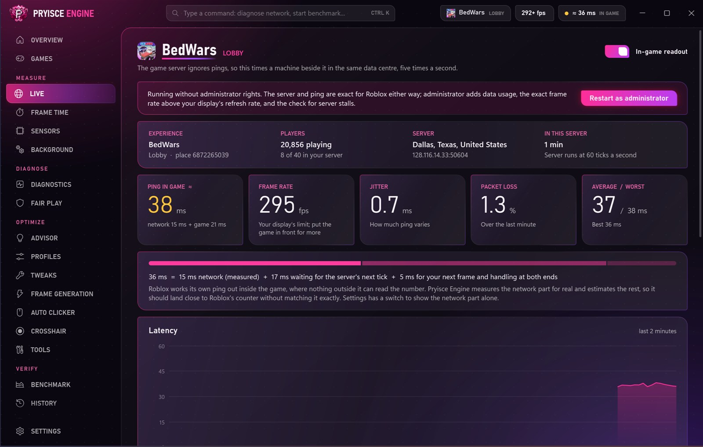

<table>
<tr>
<td width="50%">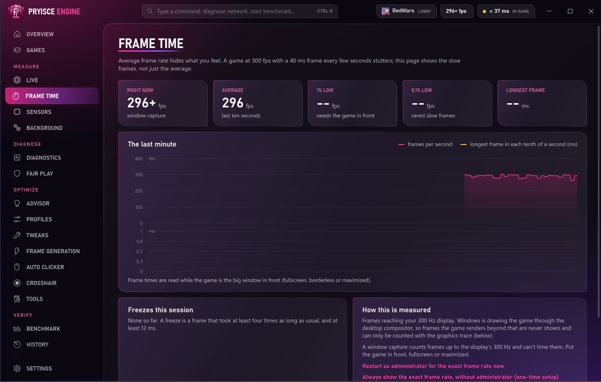</td>
<td width="50%">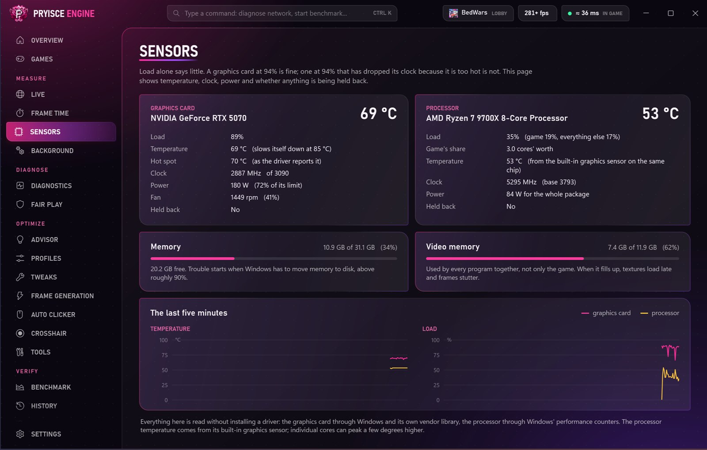</td>
</tr>
</table>

- **Live** · ping to the real game server five times a second, and where on the route the time goes
- **Frame Time** · frame rate ten times a second, with the lows and every freeze
- **Sensors** · temperatures, clocks, power and fans, with no driver to install
- **Background** · which programs are taking performance from the game, and a way to pause them

## Diagnose

Find the cause instead of guessing.

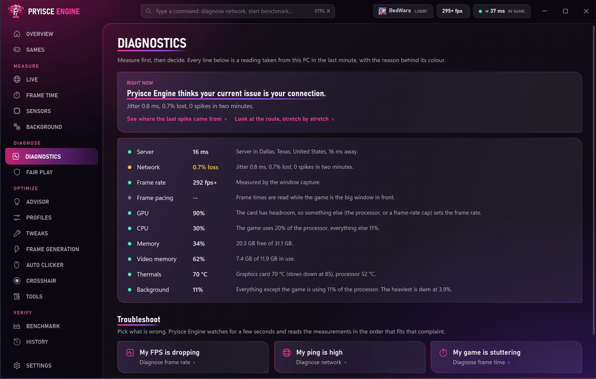

- **Diagnostics** · six troubleshooters that check the likely causes in order
- **Fair Play** · "was that lag me?" pins a ping spike to your router, your provider or the server

## Optimize

Change only what has a reason on your PC.

<table>
<tr>
<td width="50%">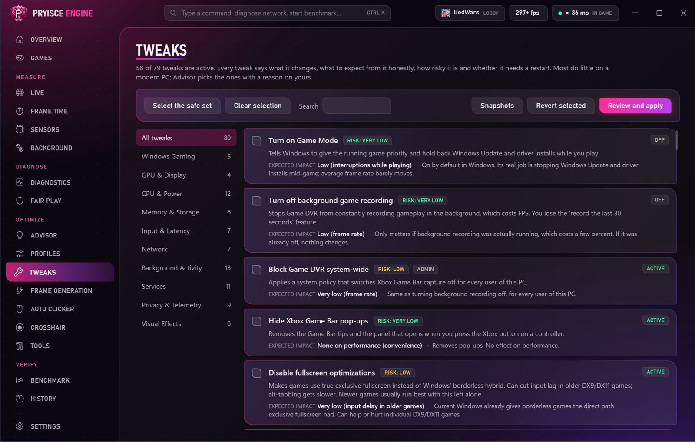</td>
<td width="50%">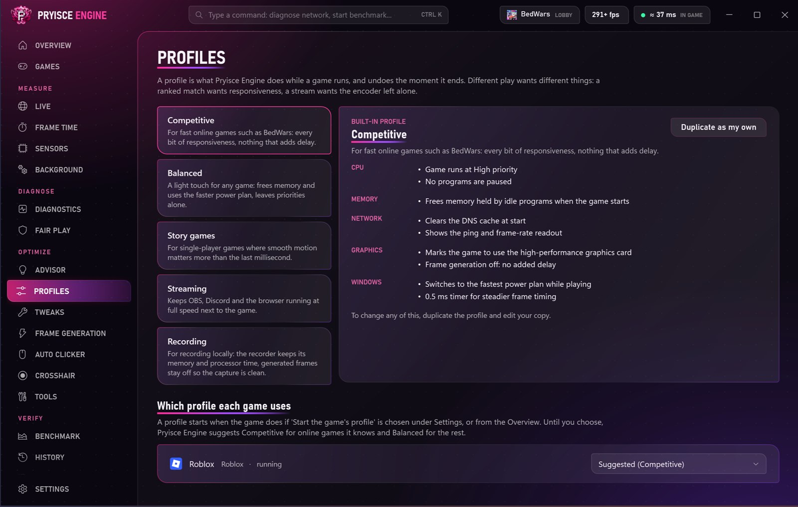</td>
</tr>
</table>

- **Advisor** · suggests only what fits your PC, with its impact and its risk
- **Tweaks** · eighty Windows and network tweaks, each explained and reversible
- **Profiles** · settings for how you play, applied when a game starts and undone when it closes
- **Frame Generation** · extra frames for Roblox
- **Tools** · a toolbox of one-off jobs

## Verify

Prove the change helped, or take it back.

<table>
<tr>
<td width="50%">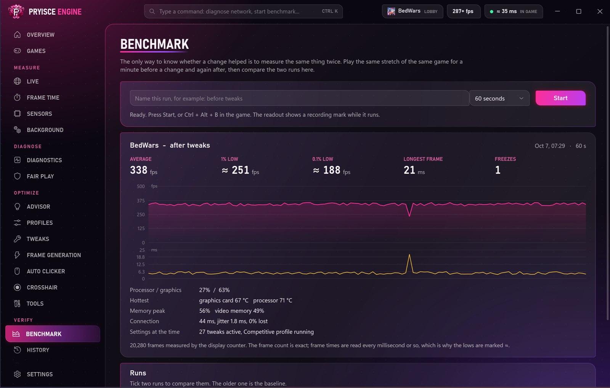</td>
<td width="50%">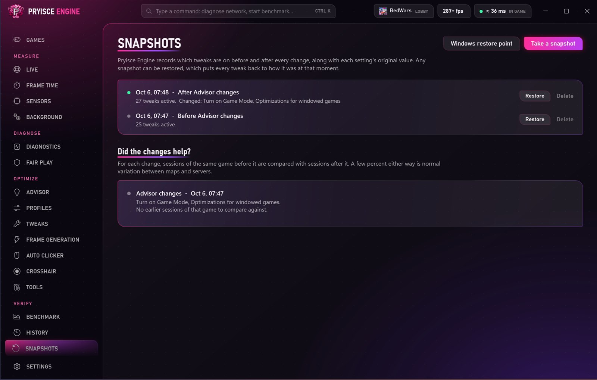</td>
</tr>
</table>

- **Benchmark** · timed runs before and after a change, side by side
- **History** · every session recorded, with a replay you can scrub through
- **Snapshots** · the state of your PC before each change, so anything can be undone

## Built for Roblox

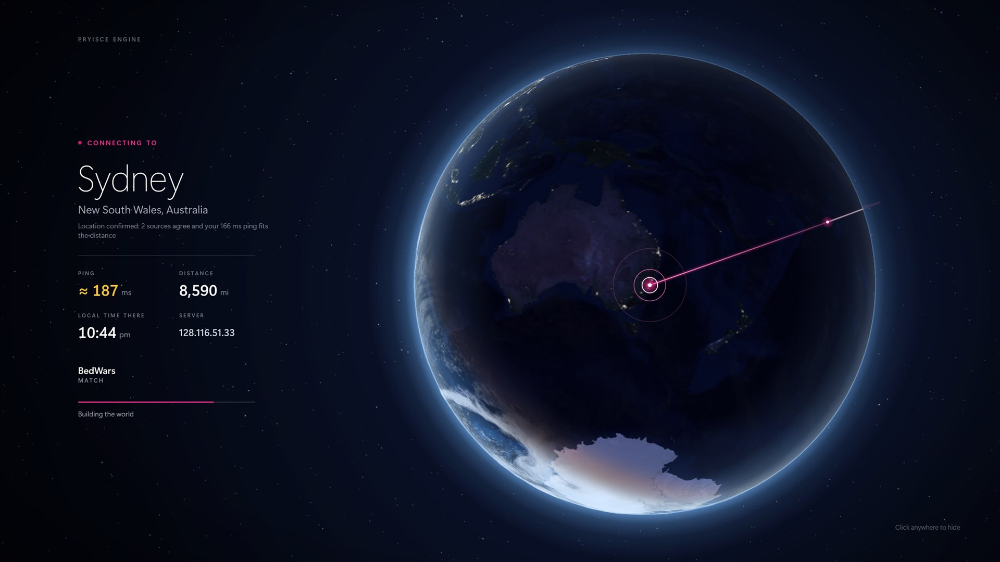

- **Server globe** · on every join and teleport a 3D Earth turns to the data centre you are connecting to, and stays until you have loaded in

<table>
<tr>
<td width="50%">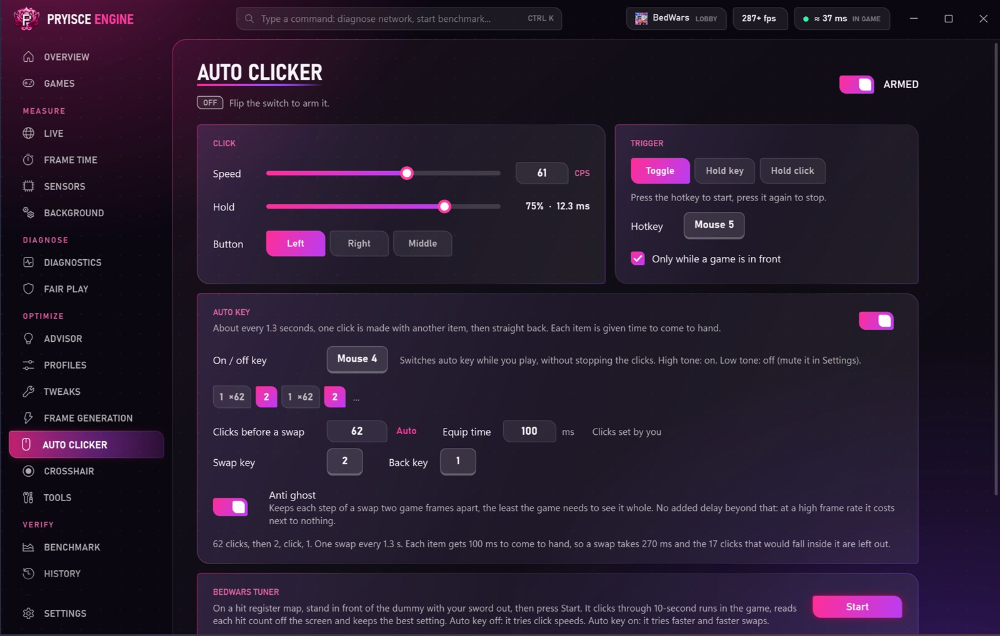</td>
<td width="50%">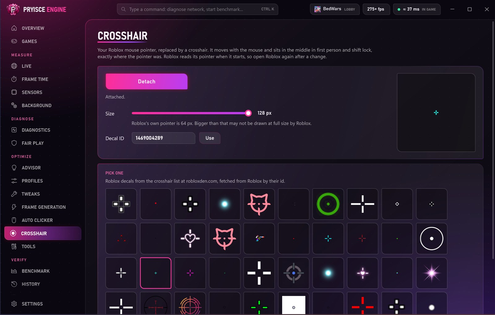</td>
</tr>
</table>

- **Auto Clicker** · no speed cap, clicks on an even beat, auto key swap, and a tuner that finds your best settings
- **Crosshair** · replaces Roblox's mouse pointer with a crosshair you pick, at the size you pick
- **BedWars** · always sprint and anti stick drift, shown only while you are in BedWars

## Make it yours

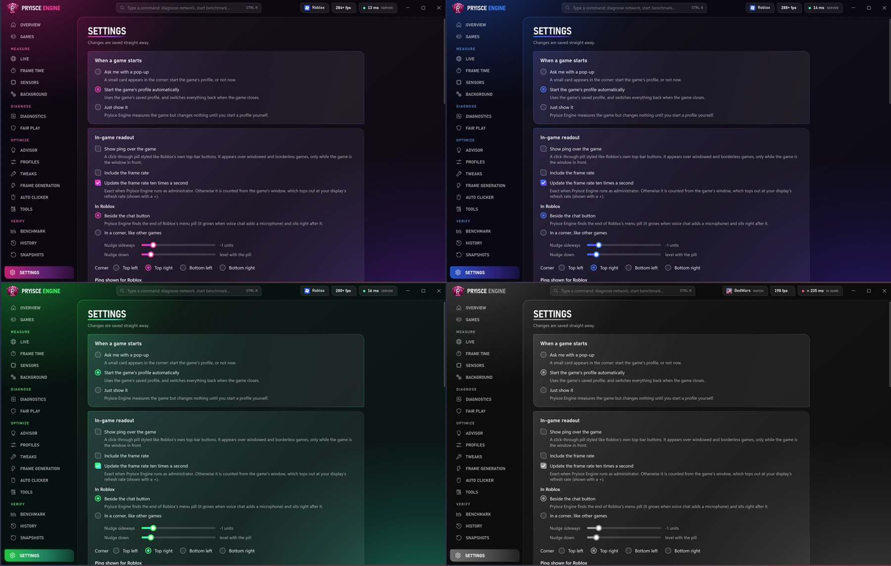

- **Settings** · in-game readout, hotkeys, sounds and 24 colour palettes
- **Overview** and **Games** · everything about the game you are in on one screen, and your library with a profile per game
- **Updates itself** · close the app and open it again; that is the whole update

## Install

1. Download `PryisceEngine-x.y.z.zip` from the [latest release](https://github.com/pryisce/pryisce-engine/releases/latest).
2. Unzip it anywhere and run `Pryisce.exe`.

Needs Windows 10 or 11 (64-bit) and the [.NET 10 Desktop Runtime](https://dotnet.microsoft.com/download/dotnet/10.0).

## Is it safe?

You should not have to take anyone's word for it. These are real scan reports you can open:

| Scanner | Result | What was scanned | |
|---|---|---|---|
| **VirusTotal** | **0 of 71** security vendors flagged it | `Pryisce.exe`, version 0.0.16 | [**Open the report**](https://www.virustotal.com/gui/file/706a5b2969a77725f8e8f87b6a574f8c3a87f190dbfaf01b5f8b33104276e478) |
| **Triage sandbox** | **3 / 10** (static 3, behaviour 1), where 10 is known malware | `Pryisce.exe`, an earlier version | [**Open the report**](https://tria.ge/261007-ef13ea1zay) |

Scanned 7 October 2026. `Pryisce.exe` is the program's launcher; a report covers the version it names, and every release is a new file.

**Check the copy you downloaded.** This is the fingerprint of the latest release. Search for it on [virustotal.com](https://www.virustotal.com/gui/home/search), or upload the zip there yourself.

<!-- scan:start -->
| | |
|---|---|
| Latest release | `PryisceEngine-0.0.27.zip` |
| SHA-256 | `421513F284C38E465A520D8F709955D0482329296C0BF1DB8387ADB7E2AE9566` |
<!-- scan:end -->

**What it does and does not do**

- No account, no telemetry, nothing collected about you.
- No code is injected into any game and no game memory is read.
- The auto clicker, always sprint and anti stick drift send ordinary keyboard and mouse input.
- The crosshair swaps three pointer pictures in Roblox's folder, keeps the originals, and puts them back when you detach it.
- Every tweak is saved in a snapshot first and can be undone.
- Updates are signed: a copy ignores any update or instruction that does not carry the publisher's signature.
- It goes online only to check GitHub for updates, to look up where a game server is, and to read public Roblox information (names, pictures, crosshair decals).

> [!WARNING]
> Auto clickers, input helpers and modified game files can be against a game's rules. Using those features online is your own decision and your own risk; an account can be actioned for it. The measuring, diagnosing and optimizing features do not touch the game.

---

Pryisce Engine is not affiliated with Roblox Corporation or any game publisher.

